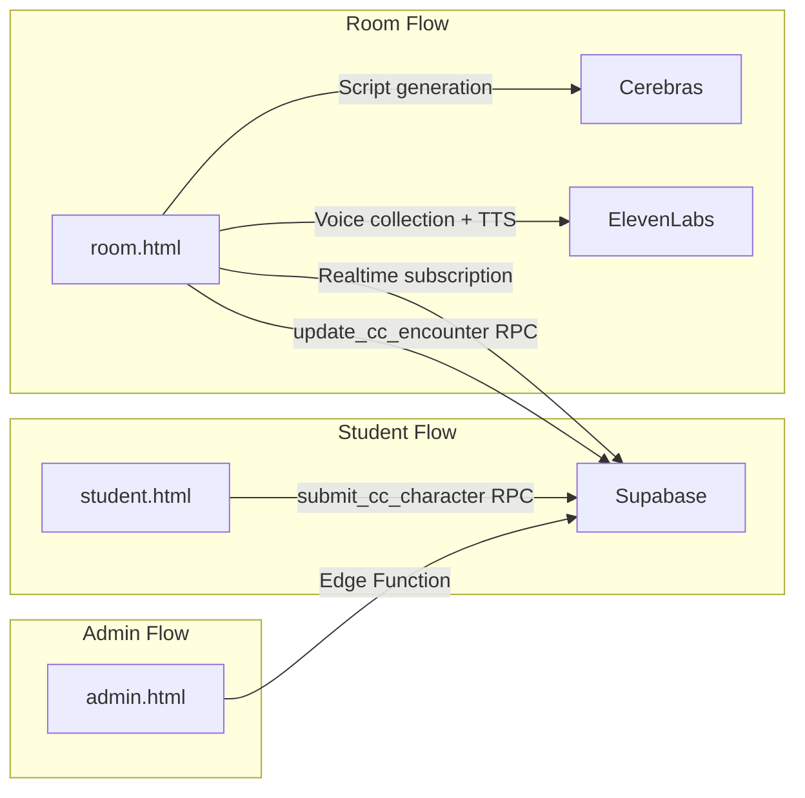

# Character Clash Implementation Plan

## Overview

Students write `initializeCharacter(location)` code that defines a character via `setFullName()`, `setMood()`, `setDescription()`, `setBackstory()`, `setItems()`. The admin queues encounters between characters at specific locations. The Room UI executes both characters, calls Cerebras LLM to generate a script with voice assignments from an ElevenLabs collection, plays the dialog via Text-to-Dialog API, and updates XP.

## Architecture

## Database Schema

New tables in `code_mob` schema (see [rps_arena migration](supabase/migrations/20260401000000_rps_arena.sql) for patterns):

- **cc_tournaments**: `id`, `name`, `locations` (JSONB), `continuous`, `paused`, `encounter_delay_ms`, `max_characters_per_student`, `is_active`, `created_at`
- **cc_approved_names**: `(tournament_id, name)` PK
- **cc_students**: `(tournament_id, name)` PK
- **cc_characters**: `id`, `tournament_id`, `student_name`, `character_name`, `version`, `code`, `language`, `character_data` (JSONB), `xp`, `encounter_wins`, `encounter_losses`, `is_archived`, `submitted_at`
- **cc_encounter_queue**: `id`, `tournament_id`, `character_a_id`, `character_b_id`, `location`, `position`, `status`, `winner_character_id`, `xp_delta_a`, `xp_delta_b`, `script` (JSONB), `created_at`

RPCs: `submit_cc_character`, `archive_cc_character`, `update_cc_encounter`

## Files to Create

- `character-clash/student.html` - Student editor with CodeMirror, character name input, JS/Python toggle, test all locations, submit
- `character-clash/admin.html` - Tournament config, approved names, character list, encounter queue with drag-reorder
- `character-clash/room.html` - Encounter playback with Cerebras script generation and ElevenLabs Text-to-Dialog
- `character-clash/shared.css` - Shared styles
- `supabase/migrations/20260411000000_character_clash.sql` - Tables, indexes, RLS, Realtime, RPCs
- `supabase/functions/character-clash-admin/index.ts` - Edge function for admin operations

## Files to Modify

- `2026/index.html` - Add card linking to Character Clash student page

## Key Implementation Details

**Student UI**:
- Character name in text input (like function name in RPS Arena)
- Editor body wraps in `initializeCharacter(location)` / `initialize_character(location)`
- Test button runs code with each location from tournament config
- All tests must pass before submit is enabled

**Room UI**:
- On load: fetch voices from ElevenLabs "Character Clash" collection
- LLM prompt includes character info as prose + available voices
- LLM returns `{script: [{speaker, line, voice_id}, ...], xp_a, xp_b}`
- Single Text-to-Dialog API call plays multi-speaker audio
- Updates XP on both characters after encounter

**Admin UI**:
- HTML5 drag-and-drop for queue reordering
- "Queue All vs All" generates encounters for every character pair
